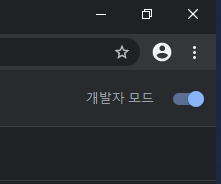
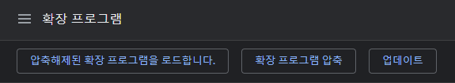
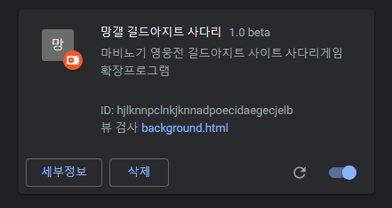
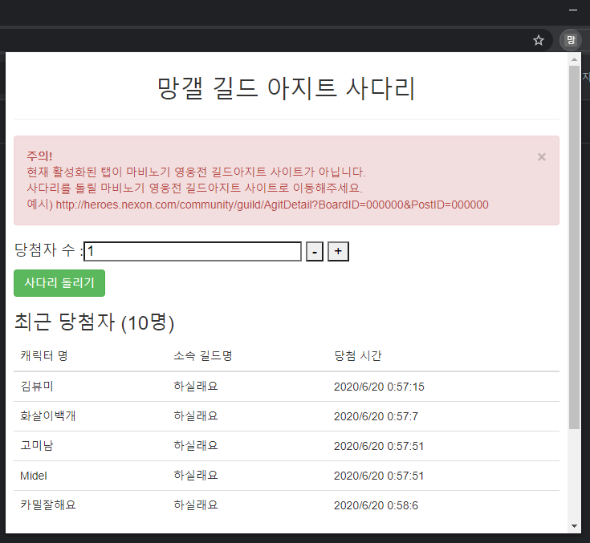

# 마비노기 영웅전 길드 아지트 추첨 확장 프로그램

## Beta 버전 사용방법

정식 버전이 아닌 베타버전의 경우에는 크롬 웹스토어에 등록하지 않을 예정입니다.
따라서, 아래의 방법을 따라주세요.

+ **필수 조건** : chrome Browser가 설치되어 있어야합니다.

1. 추첨 프로그램 베타버전 다운로드

[베타 버전 다운로드 (v0.9.0-beta)](https://github.com/gobunge/vindictus_guild_draw/releases)

2. 크롬 브라우저를 열어서 주소 입력창에 해당 URL 입력

`chrome://extensions/`

## 설치 및 사용방법

1. 위의 URL로 접근 후 우상단의 개발자 모드 활성화

2. 좌상단의 압축해제한 확장프로그램 로드 클릭

그 뒤에 다운로드 받은 압축파일을 압축을 해제한 폴더를 넣어주시면 됩니다.

3. 설치 확인

위와 같은 그림이 나왔으면 정상적으로 설치가 완료된 것입니다. 

4. 추첨 프로그램 사용

해당 프로그램은 마비노기 영웅전 공식 홈페이지 > **길드아지트** 에서만 사용하실 수 있습니다. 

프로그램 실행 시 주의사항과 같이 해당 URL 형식이 맞는지 확인해주십시오.
그 후에 확장프로그램을 열어서 사다리 돌리기를 실행하면 정상적으로 동작됩니다.

